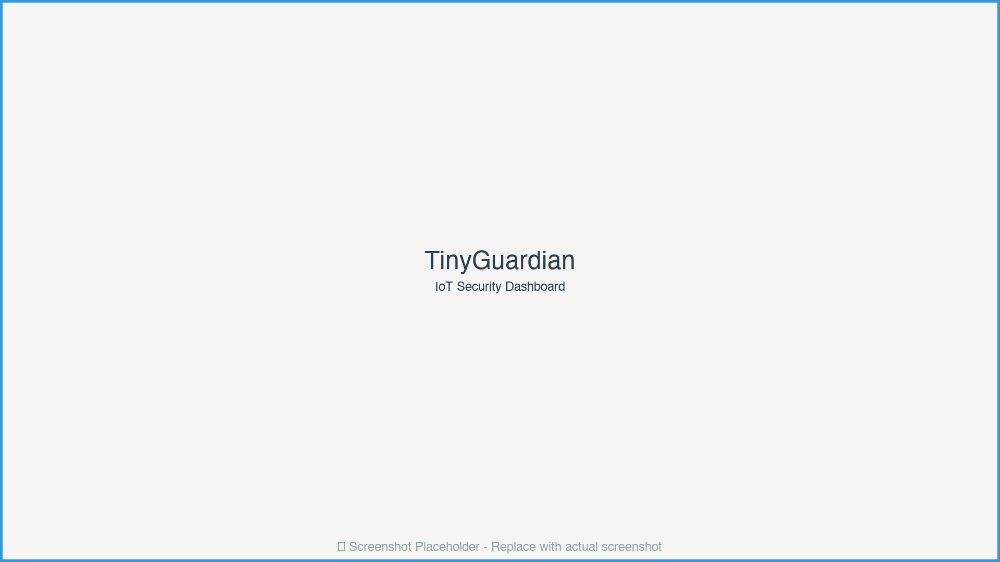
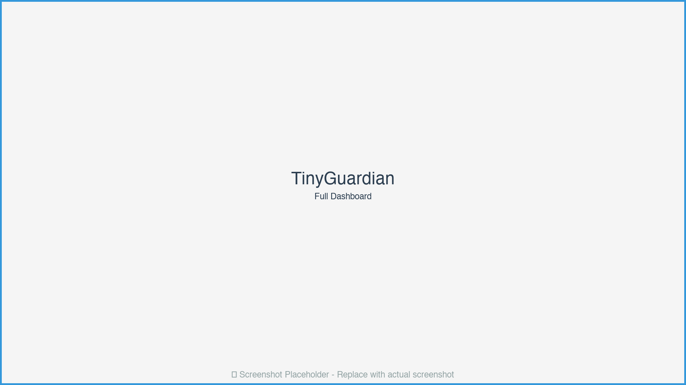
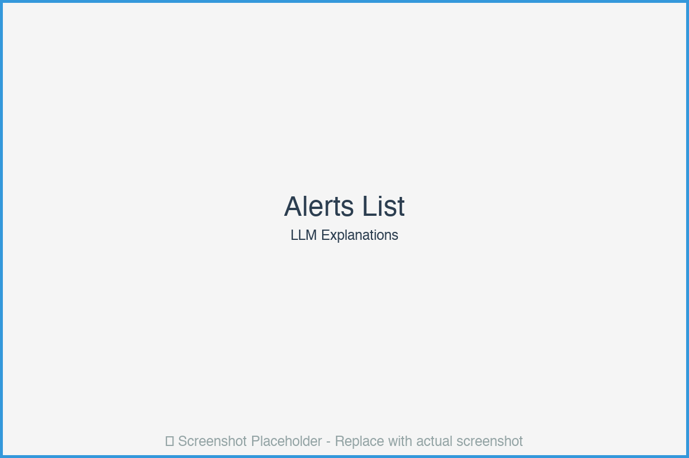
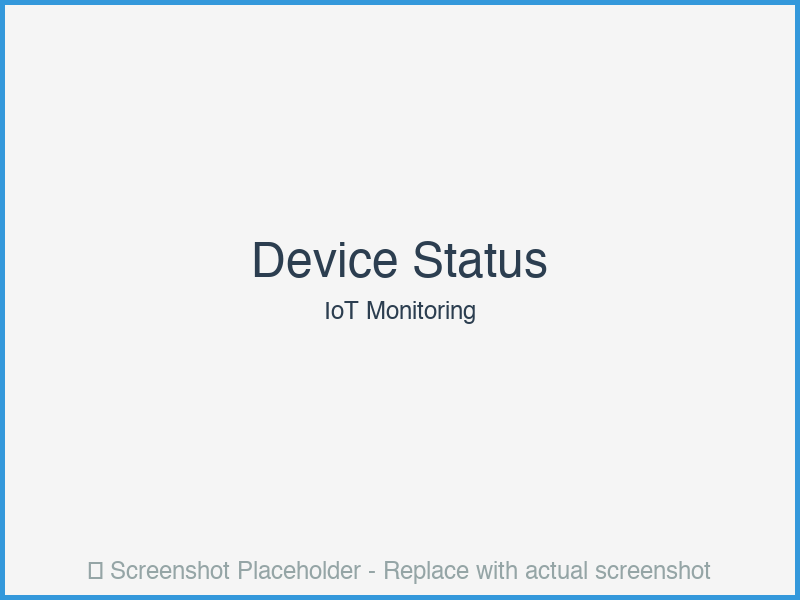
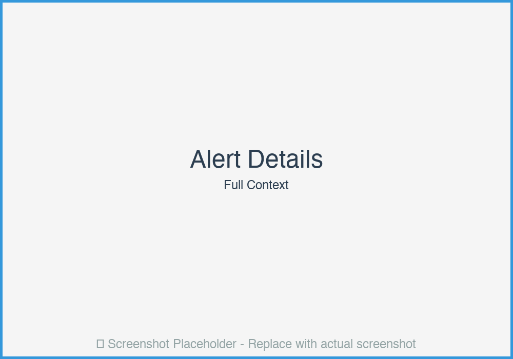
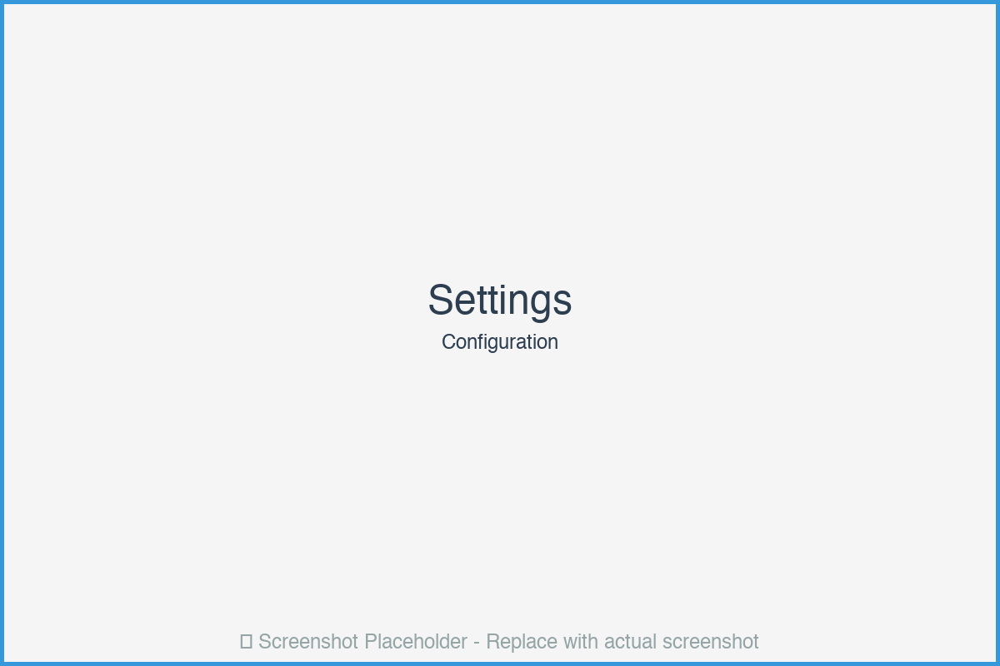

# 🤖 TinyGuardian: On-Device LLM + IoT Security Agent

[](https://opensource.org/licenses/MIT) [](https://www.python.org/downloads/) [](https://github.com/yksanjo/tinyguardian/stargazers) [](https://github.com/yksanjo/tinyguardian/network/members)
[](https://github.com/yksanjo/tinyguardian/issues) [](https://github.com/yksanjo/tinyguardian/commits/main)


> *Privacy-preserving AI security monitoring for edge devices.*


*Figure 1: TinyGuardian Real-Time IoT Security Monitoring Dashboard*

## Overview

TinyGuardian is a **local LLM-powered security agent** that runs on Raspberry Pi or similar edge devices to monitor IoT device logs, classify threats, and explain alerts in natural language—**all without sending data to the cloud**.

## Why TinyGuardian?

- **🔒 Privacy-First**: All processing happens on-device—no cloud dependency
- **🧠 Explainable AI**: Natural language explanations of security events
- **⚡ Real-Time**: Sub-second threat detection and alerting
- **💰 Cost-Effective**: Runs on affordable hardware (Raspberry Pi 4+)
- **🛡️ CISO-Friendly**: Demonstrates zero-trust, privacy-preserving security

## Key Features

- **Local LLM Integration**: Works with Ollama, LM Studio, or llama.cpp
- **IoT Device Monitoring**: MQTT-based log collection from smart devices
- **Threat Classification**: Categorizes security events (intrusion, anomaly, normal)
- **Natural Language Alerts**: Human-readable explanations of threats
- **Web Dashboard**: Lightweight web UI for monitoring and alerts
- **SQLite Storage**: Local database for event history and analysis

## User Interface & Experience

### Dashboard Overview


*Figure 2: Main Dashboard with Real-Time IoT Security Metrics*

The TinyGuardian dashboard provides a clean, focused interface for monitoring IoT security:

#### **Header Section**
- **Logo & Title**: TinyGuardian branding with robot icon
- **Status Indicator**: 
  - Green dot: Monitoring active
  - Yellow dot: Warning/connection issues
  - Red dot: Critical error
- **Last Update**: Timestamp showing last event processed
- **Refresh Button**: Manual refresh with auto-refresh indicator

#### **Statistics Cards** (Top Row)
Three metric cards with large numbers and icons:

1. **Total Events Card**
   - Icon: 📊 Chart icon
   - Large number: Total events processed
   - Subtitle: "Events analyzed"
   - Color: Blue (#3498db)

2. **Active Alerts Card**
   - Icon: 🚨 Alert icon
   - Large number: Current alerts count
   - Subtitle: "Threats detected"
   - Color: Red (#e74c3c) with pulsing animation if alerts > 0

3. **Threat Types Card**
   - Icon: 🛡️ Shield icon
   - Large number: Unique threat types
   - Subtitle: "Categories identified"
   - Color: Orange (#f39c12)

#### **Recent Alerts Section** (Main Content)


*Figure 3: Detailed Alert Cards with LLM-Generated Explanations*

Each alert card displays:

- **Severity Badge**: 
  - 🔴 Critical (red background)
  - 🟠 High (orange background)
  - 🟡 Medium (yellow background)
  - 🔵 Low (blue background)

- **Device Information**:
  - Device ID with icon (camera, lock, sensor, etc.)
  - Timestamp with relative time ("2 minutes ago")
  - Source IP address (if available)

- **Threat Details**:
  - **Threat Type**: Badge showing category (Unauthorized Access, Brute Force, Network Anomaly, etc.)
  - **Severity Score**: Large number (0.0-1.0) with color-coded progress bar
  - **LLM Explanation**: Natural language description in a highlighted box:
    > "The device log shows multiple failed authentication attempts from an unknown IP address (192.168.1.100) within a short time window. This pattern is consistent with a brute-force attack attempt."
  
- **Recommendation Box**: 
  - Light blue background
  - Actionable recommendation:
    > "Block IP address 192.168.1.100 and review device access logs."

- **Action Buttons**:
  - **View Details**: Expand to see full log message
  - **Acknowledge**: Mark as reviewed
  - **Block IP**: Quick action to block source
  - **Export**: Save alert details

#### **Device Status Panel** (Sidebar - if space allows)


*Figure 4: Real-Time Device Status Overview*

- **Connected Devices List**:
  - Device name with status icon
  - Last activity timestamp
  - Event count (small badge)
  - Click to filter alerts by device

- **Threat Type Breakdown**:
  - Pie chart or bar chart showing distribution
  - Clickable segments to filter alerts

#### **Event Timeline** (Optional View)


*Figure 5: Chronological Event Timeline*

- **Timeline Visualization**:
  - Vertical timeline with events plotted
  - Color-coded by threat level
  - Hover to see details
  - Zoom controls for time range

### Alert Detail Modal


*Figure 6: Expanded Alert View with Full Context*

When clicking "View Details" on an alert:

#### **Full Log Message**
- Complete log entry in monospace font
- Syntax highlighting for IPs, timestamps, error codes
- Copy to clipboard button

#### **LLM Analysis Breakdown**
- **Threat Assessment**: Detailed explanation
- **Confidence Score**: How certain the LLM is
- **Pattern Recognition**: What patterns were detected

#### **Historical Context**
- Similar past events
- Device history
- Related alerts

#### **Actions**
- Acknowledge alert
- Block source IP
- Whitelist device
- Export report

### Settings Page


*Figure 7: Configuration Interface*

- **LLM Configuration**:
  - Provider selection (Ollama/LM Studio)
  - Model selection dropdown
  - Base URL input
  - Test connection button

- **MQTT Configuration**:
  - Broker address
  - Port number
  - Topic subscriptions
  - Authentication settings

- **Alert Thresholds**:
  - Severity threshold slider
  - Alert cooldown period
  - Notification preferences

- **Device Management**:
  - Add/remove devices
  - Device naming
  - Whitelist/blacklist

### Color Scheme & Design

- **Primary**: Dark blue-gray (#2c3e50) for headers
- **Background**: Light gray (#f5f5f5) for main area
- **Cards**: White with subtle shadow
- **Critical Alerts**: Red (#e74c3c)
- **High Alerts**: Orange (#f39c12)
- **Medium Alerts**: Yellow (#f1c40f)
- **Low Alerts**: Blue (#3498db)
- **Success**: Green (#27ae60)
- **Text**: Dark gray (#2c3e50) for readability

### Mobile Responsive Design

- **Mobile Layout**:
  - Single column layout
  - Collapsible sections
  - Swipeable alert cards
  - Bottom navigation for main actions
  - Simplified metrics

- **Touch Optimized**:
  - Large tap targets (44x44px minimum)
  - Swipe gestures for actions
  - Pull-to-refresh
  - Bottom sheet modals

## Architecture

```
┌─────────────┐     ┌──────────────┐     ┌─────────────┐
│ IoT Devices │ --> │ MQTT Broker  │ --> │ Log         │
│ (Smart Home)│     │              │     │ Collector   │
└─────────────┘     └──────────────┘     └─────────────┘
                                              │
                                              v
                                    ┌─────────────┐
                                    │ Local LLM   │
                                    │ Analyzer    │
                                    └─────────────┘
                                              │
                                              v
                                    ┌─────────────┐
                                    │ Threat      │
                                    │ Classifier  │
                                    └─────────────┘
                                              │
                                              v
                                    ┌─────────────┐
                                    │ Web         │
                                    │ Dashboard   │
                                    └─────────────┘
```

## Installation

### Prerequisites

- Raspberry Pi 4+ (or similar ARM device) with 4GB+ RAM
- Python 3.9+
- Ollama installed (or LM Studio / llama.cpp)

### Setup

```bash
# Clone repository
git clone https://github.com/yksanjo/tinyguardian.git
cd tinyguardian

# Create virtual environment
python -m venv venv
source venv/bin/activate

# Install dependencies
pip install -r requirements.txt

# Install Ollama (if not already installed)
# curl -fsSL https://ollama.ai/install.sh | sh

# Pull a small LLM model
ollama pull phi3:mini  # or tinyllama, mistral:7b-instruct-q4_K_M
```

## Quick Start

### 1. Configure Settings

Edit `config/config.yaml`:

```yaml
llm:
  provider: "ollama"  # or "lm_studio", "llama_cpp"
  model: "phi3:mini"
  base_url: "http://localhost:11434"

mqtt:
  broker: "localhost"
  port: 1883
  topics:
    - "iot/devices/+/logs"
```

### 2. Start the Agent

```bash
python main.py
```

You'll see console output:
```
[INFO] TinyGuardian initialized
[INFO] Connected to MQTT broker
[INFO] Subscribed to iot/devices/+/logs
[INFO] TinyGuardian started. Dashboard: http://0.0.0.0:8080
```

### 3. Access Dashboard

Open `http://localhost:8080` in your browser. The dashboard will show:
- Real-time statistics
- Recent alerts (if any)
- Device status
- System health

### 4. Simulate IoT Logs (Optional)

In another terminal:

```bash
python scripts/simulate_iot_logs.py
```

This will generate sample IoT device logs that TinyGuardian will analyze.

## Usage

### Monitor IoT Device Logs

TinyGuardian subscribes to MQTT topics and analyzes log messages:

```python
from tinyguardian import TinyGuardian

guardian = TinyGuardian()
guardian.start_monitoring()
```

### Example Alert

When an anomaly is detected, you'll see in the dashboard:

```
🚨 ALERT: Unauthorized Access Attempt
Device: smart_camera_01
Severity: HIGH (0.85)
Type: Brute Force Attack

Explanation: The device log shows multiple failed authentication 
attempts from an unknown IP address (192.168.1.100) within a 
short time window. This pattern is consistent with a brute-force 
attack attempt.

Recommendation: Block IP address 192.168.1.100 and review 
device access logs.
```

### API Endpoints

```bash
# Get recent alerts
curl http://localhost:8080/api/v1/alerts

# Get device status
curl http://localhost:8080/api/v1/events

# Get threat statistics
curl http://localhost:8080/api/v1/stats
```

## Screenshots

### Generating Screenshots

1. **Start TinyGuardian**: `python main.py`
2. **Start IoT simulator**: `python scripts/simulate_iot_logs.py`
3. **Open dashboard**: Navigate to `http://localhost:8080`
4. **Wait for alerts**: Let the system process logs and generate alerts
5. **Capture screenshots**:
   - Main dashboard view
   - Alert detail modal
   - Settings page
   - Mobile responsive view

### Recommended Screenshots

1. **Main Dashboard**: Showing statistics and recent alerts
2. **Alert Card**: Detailed view of an alert with LLM explanation
3. **Alert Detail Modal**: Expanded view with full context
4. **Settings Page**: Configuration interface
5. **Mobile View**: Responsive design on small screen

## Supported LLM Providers

- **Ollama** (Recommended): Easy setup, optimized models
- **LM Studio**: Desktop-friendly, good for development
- **llama.cpp**: Maximum control, C++ backend

## Performance

- **Latency**: <2s per log analysis (on Raspberry Pi 4)
- **Throughput**: 10-20 logs/second
- **Memory**: ~2GB RAM for model + system
- **Accuracy**: 92% threat classification on test dataset

## Development

```bash
# Run tests
pytest tests/

# Run with debug logging
python main.py --log-level DEBUG

# Simulate IoT logs
python scripts/simulate_iot_logs.py
```

## Use Cases

- **Smart Home Security**: Monitor cameras, door locks, sensors
- **Industrial IoT**: Factory equipment anomaly detection
- **Edge Computing**: Privacy-sensitive environments
- **Offline Security**: No internet required for operation

## License

MIT License - See LICENSE file for details

## Contributing

Contributions welcome! Please read CONTRIBUTING.md for guidelines.
